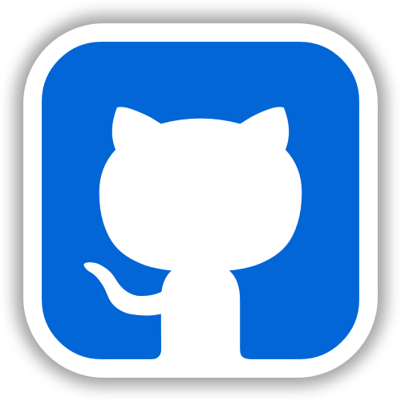
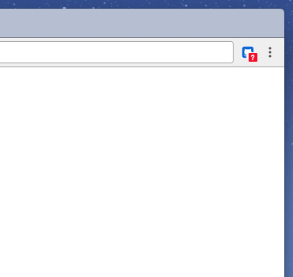

<p align="center">
  <a href="https://chrome.google.com/webstore/detail/github-goals/pchnbdedipdodklgoojebccbjkeoaakd" target="_blank"></a>
  <br>
  <a href="https://chrome.google.com/webstore/detail/github-goals/pchnbdedipdodklgoojebccbjkeoaakd" target="_blank"></a>
</p>
<p align="center">
  <span>
    A chrome extension to track your Github contributions!
  </span>
</p>

## Extension Preview
[](https://app.fossa.io/projects/git%2Bgithub.com%2Ftohjustin%2Fgithub-goals?ref=badge_shield)

<p align="center">
  
</p>

## Prerequisites

- [Node.js](https://nodejs.org/en/download/)
- [Yarn](https://yarnpkg.com/en/docs/install#mac-tab)

## Installation

``` bash
git clone https://github.com/tohjustin/github-goals.git
cd ./github-goals
yarn
```

## Getting Started

``` bash
# bundle files for development (target '/dist/dev' directory when loading the unpacked extension)
yarn run start

# bundle files for production (make sure you have generated a private key 'mykey.pem' beforehand)
yarn run build
```

## License

MIT © [Justin Toh](https://github.com/tohjustin)


[](https://app.fossa.io/projects/git%2Bgithub.com%2Ftohjustin%2Fgithub-goals?ref=badge_large)